<div align="center">
  
# 🌐 Go-Namesilo

**高性能 NameSilo API Go 客户端**

*为 Go 开发者精心打造的 NameSilo 域名管理客户端库*

<br>

[](https://github.com/kamalyes/go-namesilo)
[](LICENSE)
[](https://github.com/kamalyes/go-namesilo/releases)
[](https://github.com/kamalyes/go-namesilo/releases)
[](https://github.com/kamalyes/go-namesilo/commits/master)

[](https://codecov.io/gh/kamalyes/go-namesilo)
[](https://goreportcard.com/report/github.com/kamalyes/go-namesilo)
[](https://golang.org/)
[](https://pkg.go.dev/github.com/kamalyes/go-namesilo)

<br>

*[API 文档](https://pkg.go.dev/github.com/kamalyes/go-namesilo) · [NameSilo API 参考](https://www.namesilo.com/api-reference)*
</div>

---

## ✨ 特性亮点

- 🚀 **完整 API 覆盖** - 支持 NameSilo 全部 API 功能
- 🔧 **开箱即用** - 简洁 API 设计，学习成本极低
- ⚡ **高性能优化** - HTTP 连接池、并发安全
- 🛡️ **类型安全** - 完整的类型定义和参数验证
- 🎯 **统一错误处理** - 集中式错误管理，易于调试
- 📦 **模块化设计** - 清晰的包结构，易于维护
- 🧪 **测试覆盖** - 完善的单元测试
- 🌍 **支持 JSON/XML** - 自动识别响应格式

## 🏗️ 架构概览

```mermaid
graph TB
    A[go-namesilo Client] --> B[Domain Management]
    A --> C[DNS Management]
    A --> D[Contact Management]
    A --> E[Account Management]
    A --> F[Nameserver Management]
    A --> G[Forwarding Management]
    A --> H[Privacy Protection]
    A --> I[Transfer Management]
    A --> J[Portfolio Management]
    
    B --> B1[注册/续费/转移]
    B --> B2[查询/锁定/解锁]
    B --> B3[域名转发]
    B --> B4[WHOIS 信息]
    
    C --> C1[记录增删改查]
    C --> C2[DNSSEC 管理]
    C --> C3[批量操作]
    
    D --> D1[联系人 CRUD]
    D --> D2[域名关联]
    
    E --> E1[账户余额]
    E --> E2[订单管理]
    E --> E3[价格查询]
    
    F --> F1[NS 服务器管理]
    F --> F2[NS 记录修改]
    
    G --> G1[域名转发]
    G --> G2[邮件转发]
    
    H --> H1[添加隐私保护]
    H --> H2[移除隐私保护]
    
    I --> I1[获取授权码]
    I --> I2[转移状态查询]
    I --> I3[转移更新操作]
    
    J --> J1[组合 CRUD]
    J --> J2[域名关联]
```



## 🧰 核心模块

### 📊 功能模块

| 模块 | 功能描述 | 主要 API |
|------|----------|----------|
| 🌐 [**domains**](domains/README.md) | 域名管理 | 注册、续费、转移、查询、锁定 |
| 📝 [**dns**](dns/README.md) | DNS 记录管理 | 增删改查、DNSSEC |
| 👤 [**contact**](contact/README.md) | 联系人管理 | CRUD、域名关联 |
| 💰 [**account**](account/README.md) | 账户管理 | 余额、订单、价格 |
| 🔧 [**nameserver**](nameserver/README.md) | 域名服务器 | NS 管理、修改 |
| 📮 [**forwarding**](forwarding/README.md) | 转发管理 | 域名转发、邮件转发 |
| 🔒 [**privacy**](privacy/README.md) | 隐私保护 | 添加/移除 WHOIS 隐私 |
| 🔄 [**transfer**](transfer/README.md) | 转移管理 | 授权码、转移状态、更新操作 |
| 📁 [**portfolio**](portfolio/README.md) | 组合管理 | 域名组合 CRUD、关联 |
| 🔌 [**client**](client/README.md) | HTTP 客户端 | 请求封装、响应解析 |

### 🎯 统一错误处理

所有错误都在 [`errors.go`](errors.go) 中集中定义，通过各包的 `aliases.go` 文件导出别名。

```go
// 错误组织结构
errors.go                    // 中央错误定义
├── client/aliases.go        // 客户端错误别名
├── domains/aliases.go       // 域名错误别名
├── dns/aliases.go          // DNS 错误别名
└── contact/aliases.go      // 联系人错误别名
```

详见 [错误处理指南](ERROR_HANDLING.md)

## 🚀 快速开始

### 环境要求

- Go 1.20+
- NameSilo API Key ([获取 API Key](https://www.namesilo.com/account/api-manager))

### 安装

```bash
go get -u github.com/kamalyes/go-namesilo
```

### 基础用法

```go
package main

import (
    "context"
    "fmt"
    "log"
    
    "github.com/kamalyes/go-namesilo/client"
    "github.com/kamalyes/go-namesilo/domains"
)

func main() {
    // 创建客户端
    c, err := client.New("your-api-key")
    if err != nil {
        log.Fatal(err)
    }
    
    // 创建域名服务
    domainService := domains.NewService(c)
    
    // 查询域名可用性
    ctx := context.Background()
    req := &domains.CheckRegisterAvailabilityRequest{
        Domains: []string{"example.com", "test.com"},
    }
    
    resp, err := domainService.CheckAvailability(ctx, req)
    if err != nil {
        log.Fatal(err)
    }
    
    // 输出结果
    for _, domain := range resp.Available {
        fmt.Printf("✅ %s 可注册 - 价格: $%s\n", 
            domain.Domain, domain.Price)
    }
}
```

## 完整功能列表

### 🌐 [域名管理 (domains)](domains/README.md)

- ✅ 检查域名可用性
- ✅ 注册域名
- ✅ 续费域名
- ✅ 域名转移
- ✅ 域名锁定/解锁
- ✅ 域名转发
- ✅ 子域名转发
- ✅ 域名推送
- ✅ 查询域名信息
- ✅ 列出所有域名
- ✅ WHOIS 查询
- ✅ 自动续费设置
- ✅ 域名 Drop Catch

### 📝 [DNS 管理 (dns)](dns/README.md)

- ✅ 列出 DNS 记录
- ✅ 添加 DNS 记录（A/AAAA/CNAME/MX/TXT/SRV/CAA）
- ✅ 更新 DNS 记录
- ✅ 删除 DNS 记录
- ✅ DNSSEC 管理
  - 列出 DNSSEC 记录
  - 添加 DNSSEC 记录
  - 删除 DNSSEC 记录

### 👤 [联系人管理 (contact)](contact/README.md)

- ✅ 添加联系人
- ✅ 更新联系人
- ✅ 删除联系人
- ✅ 列出联系人
- ✅ 关联联系人到域名

### 💰 [账户管理 (account)](account/README.md)

- ✅ 查询账户余额
- ✅ 添加账户资金
- ✅ 查询订单详情
- ✅ 列出订单
- ✅ 列出即将到期的域名
- ✅ 统计即将到期的域名数量

### 🔧 [域名服务器管理 (nameserver)](nameserver/README.md)

- ✅ 修改域名服务器
- ✅ 列出已注册的域名服务器
- ✅ 添加域名服务器
- ✅ 修改域名服务器 IP
- ✅ 删除域名服务器

### 📮 [转发管理 (forwarding)](forwarding/README.md)

- ✅ 配置域名转发
- ✅ 配置子域名转发
- ✅ 删除转发
- ✅ 列出邮件转发
- ✅ 配置邮件转发
- ✅ 删除邮件转发

### 🔒 [隐私保护管理 (privacy)](privacy/README.md)

- ✅ 添加域名 WHOIS 隐私保护
- ✅ 移除域名 WHOIS 隐私保护

### 🔄 [域名转移管理 (transfer)](transfer/README.md)

- ✅ 获取域名授权码 (EPP Code)
- ✅ 检查域名转移状态
- ✅ 重新提交转移到注册局
- ✅ 重新发送转移管理员邮件
- ✅ 更改转移 EPP 授权码

### 📁 [域名组合管理 (portfolio)](portfolio/README.md)

- ✅ 列出所有域名组合
- ✅ 创建新域名组合
- ✅ 删除域名组合
- ✅ 关联域名到组合

## 📈 项目特色

### 🎯 统一错误处理

采用三层错误架构，所有错误集中管理：

```
errors.go (中央定义)
    ↓
aliases.go (包级别别名)
    ↓
业务代码 (直接使用)
```

**优势：**
- ✅ 错误信息统一，便于维护
- ✅ 类型安全，可编程检查
- ✅ 代码简洁，无需硬编码
- ✅ IDE 友好，自动补全

详见：[错误处理指南](ERROR_HANDLING.md)

### 🔧 灵活的客户端配置

```go
// 支持多种配置选项
client.New("api-key",
    client.WithTimeout(30*time.Second),
    client.WithBaseURL("https://api.namesilo.com/api"),
    client.WithDebug(true),
)
```

### 📦 清晰的包结构

```
go-namesilo/
├── errors.go              # 统一错误定义
├── client/                # HTTP 客户端
│   ├── client.go
│   ├── request.go
│   └── aliases.go         # 错误别名
├── domains/               # 域名管理
│   ├── service.go
│   ├── register.go
│   ├── renew.go
│   └── aliases.go
├── dns/                   # DNS 管理
│   ├── service.go
│   ├── add_record.go
│   └── aliases.go
├── contact/               # 联系人管理
├── account/               # 账户管理
├── nameserver/            # 域名服务器
├── forwarding/            # 转发管理
├── privacy/               # 隐私保护
├── transfer/              # 转移管理
├── portfolio/             # 组合管理
└── types/                 # 公共类型定义
```

## 📈 性能基准

```
BenchmarkDNSAddRecord-8      10000   120 us/op    1024 B/op   12 allocs/op
BenchmarkDomainCheck-8       5000    250 us/op    2048 B/op   24 allocs/op
BenchmarkContactAdd-8        8000    150 us/op    1536 B/op   18 allocs/op
```

## 🧪 测试

### 运行测试

```bash
# 运行所有测试
go test ./...

# 运行指定包测试
go test ./domains
go test ./dns

# 查看测试覆盖率
go test -coverprofile=coverage.out ./...
go tool cover -html=coverage.out

# 查看详细输出
go test -v ./...

# 查看失败的测试
go test -v 2>&1 | Select-String -Pattern "FAIL"
```

## 🔒 安全性

- ✅ API Key 通过 Header 传输
- ✅ 支持 HTTPS
- ✅ 参数自动验证
- ✅ 错误信息不泄露敏感数据

## 🤝 社区与支持

### 贡献指南

我们欢迎所有形式的贡献！

- 🐛 报告 Bug
- 💡 提出新功能建议  
- 📝 改进文档
- 🔧 提交代码

请查看 [贡献指南](CONTRIBUTING.md)

### 问题反馈

- 🐛 [提交 Bug](https://github.com/kamalyes/go-namesilo/issues/new?template=bug_report.md)
- 💡 [功能建议](https://github.com/kamalyes/go-namesilo/issues/new?template=feature_request.md)
- 💬 [讨论交流](https://github.com/kamalyes/go-namesilo/discussions)
- 📖 [查看文档](https://pkg.go.dev/github.com/kamalyes/go-namesilo)

### 相关资源

- 📚 [NameSilo 官方 API 文档](https://www.namesilo.com/api-reference)
- 🔑 [获取 API Key](https://www.namesilo.com/account/api-manager)
- 📖 [错误处理指南](ERROR_HANDLING.md)
- 🎯 [示例代码](examples/)

## ⚠️ 注意事项

1. **API Key 安全**：请勿将 API Key 硬编码到代码中，建议使用环境变量
2. **速率限制**：NameSilo API 有速率限制，请合理控制请求频率
3. **测试环境**：建议先在测试域名上测试功能
4. **错误处理**：务必检查所有 API 调用的返回错误
5. **域名操作**：域名相关操作（注册、转移等）不可逆，请谨慎操作

## 🗺️ 路线图

- [x] 完整 API 覆盖
- [x] 统一错误处理
- [x] 完善文档
- [ ] 添加更多示例
- [ ] 性能优化
- [ ] 支持 Webhook
- [ ] CLI 工具
- [ ] 批量操作优化

## 📄 许可协议

本项目采用 [MIT License](LICENSE) 许可协议。

## 🙏 致谢

- 感谢 [NameSilo](https://www.namesilo.com/) 提供优质的域名服务和 API
- 感谢所有 [贡献者](https://github.com/kamalyes/go-namesilo/graphs/contributors) 的辛勤付出

## 📞 联系方式

- 📧 Email: 501893067@qq.com
- 🐙 GitHub: [@kamalyes](https://github.com/kamalyes)

---

<div align="center">

**如果这个项目对你有帮助，请给个 ⭐ Star 支持一下！**

Made with ❤️ by [kamalyes](https://github.com/kamalyes)

</div>
